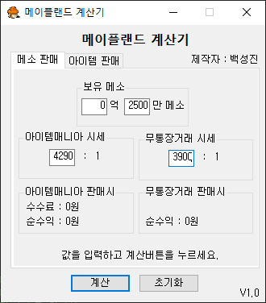

### - 프로젝트명
- 메이플 랜드 계산기 프로그램

### - 개발 환경
- C#, Visual Studio 2022

### - 주요 기능
- 자신이 보유한 게임 머니의 판매 방식별 시세에 따른 현금 가치 계산
- 게임 머니 거래 중계사이트(이하 아이템매니아)에서 게임 머니 판매시의 수수료 및 순이익 계산 가능
- 1:1 개인거래인 무통장거래 시세와 아이템매니아의 시세, 수수료를 계산하여 어떤방식의 판매가 더 이득인지 계산
- 자신이 보유한 게임 아이템 판매시 판매 방식, 판매 금액별로 다른 수수료 계산 및 순이익 계산

### - 구동 과정
#### 1. 메소 판매 (게임 머니 현금가치, 수수료 계산 및 비교)


```c#
public string mania_default = "4500"; // 초기값
public string bank_default = "4000";

public class Exchange   // 메소 판매 탭
{
    public int money_first { get; set; }    // 억단위
    public int money_second { get; set; }   // 만단위
    public int mania_ratio { get; set; }    // 아이템매니아 시세
    public int bank_ratio { get; set; }     // 무통장거래 시세

    // 아이템매니아 사이트 실제 수수료 방식 적용
    public static int mania_high_commission_limit = 940000; // 최대 수수료 상한선
    public static int mania_high_commission = 47000;        // 최대 수수료 금액
    public static int mania_low_commission_limit = 20000;   // 최저 수수료 하한선
    public static int mania_low_commission = 1000;          // 최저 수수료 금액
    public static int mania_commission_percentage = 5;      // 통상 수수료 5%
    public static int mania_cash_out_commission = 1000;     // 출금 수수료 고정 1000원
    public long money_total { get; set; }       // 억, 만 단위 입력 변환 하여 저장할 실제 보유 금액
    public long mania_commission { get; set; }  // 아이템매니아 수수료
    public long mania_result { get; set; }      // 아이템매니아 판매시 순이익
    public long bank_result { get; set; }       // 무통장거래 판매시 순이익
    public Exchange()
    {
        this.money_first = 0;
        this.money_second = 0;
        this.mania_ratio = 0;
        this.bank_ratio = 0;
        this.money_total = 0;
        this.mania_commission = 0;
        this.mania_result = 0;
        this.bank_result = 0;
    }
    public void Calc(string moneyfirst, string moneysecond, string maniaratio, string bankratio)
    {
        try
        {
            if (int.TryParse(moneyfirst, out int int_moneyfirst) &&
                int.TryParse(moneysecond, out int int_moneysecond) &&
                int.TryParse(maniaratio, out int int_maniaratio) &&
                int.TryParse(bankratio, out int int_bankratio))
            {
                this.money_first = int_moneyfirst;
                this.money_second = int_moneysecond;
                this.mania_ratio = int_maniaratio;
                this.bank_ratio = int_bankratio;
                this.money_total = (long)(this.money_first * 10000 + this.money_second) / 100; // 억, 만 단위로 입력받은 값을 계산하여 변환

                this.mania_result = (long)(money_total * this.mania_ratio); // 1차 계산
                this.bank_result = (long)(money_total * this.bank_ratio);

                // 판매 금액 별로 다른 수수료 계산
                if (this.mania_result < Exchange.mania_low_commission_limit) // 판매금액 2만원 미만시
                {
                    this.mania_commission = Exchange.mania_low_commission + Exchange.mania_cash_out_commission; // 고정수수료 1000원 + 출금수수료 1000원
                }
                else if (this.mania_result > Exchange.mania_high_commission_limit) // 판매금액 94만원 초과시
                {
                    this.mania_commission = Exchange.mania_high_commission + Exchange.mania_cash_out_commission; //고정수수료 47000원 + 출금수수료 1000원
                }
                else if (this.mania_result <= Exchange.mania_high_commission_limit &&
                         this.mania_result >= Exchange.mania_low_commission_limit) // 판매금액 2만원 이상 ~ 94만원 이하 시
                {   // 판매금액의 5% 수수료 + 출금수수료 1000원
                    this.mania_commission = (long)(money_total * this.mania_ratio * Exchange.mania_commission_percentage / 100) + Exchange.mania_cash_out_commission;
                }   
                this.mania_result = this.mania_result - this.mania_commission;  // 수수료를 뺀 순수익 계산
            }
            else
            {
                MessageBox.Show("잘못된 값이 입력 되었습니다.");
            }
        }
        catch
        {
            MessageBox.Show("잘못된 값을 입력 했습니다.");
        }
    }
}
Exchange ex = new Exchange();
private void calc_button_Click(object sender, EventArgs e) // 계산 버튼을 누를경우
{
    if (main_tab.SelectedTab == main_tab_page1) // 메소 판매 탭인경우
    {
        if (string.IsNullOrEmpty(money_first_box.Text)) // 사용자가 만단위만 계산하려고 억단위 숫자를 지운경우 0으로 강제 설정
        { money_first_box.Text = "0"; }
        if (string.IsNullOrEmpty(money_second_box.Text)) // 사용자가 억단위만 계산하려고 만단위 숫자를 지운경우 0으로 강제 설정
        { money_second_box.Text = "0"; }

        if (int.TryParse(money_first_box.Text, out int int_moneyfirst) &&   // 금액 파싱
            int.TryParse(money_second_box.Text, out int int_moneysecond) &&
            int.TryParse(mania_box.Text, out int int_maniaratio) &&
            int.TryParse(bank_box.Text, out int int_bankratio))
        {
            if (int.Parse(money_first_box.Text) < 0) // 음수 처리
            { money_first_box.Text = "0"; }
            if (int.Parse(money_second_box.Text) < 0)
            { money_second_box.Text = "100"; }

            if (int.Parse(money_first_box.Text) > 9999) // 최대값 처리 및 종료
            { money_first_box.Text = "9999"; MessageBox.Show("9999억을 초과할 수 없습니다."); return; }
            if (int.Parse(money_second_box.Text) > 9999)
            { money_second_box.Text = "9999"; MessageBox.Show("9999만을 초과할 수 없습니다."); return; }

            if (string.IsNullOrEmpty(mania_box.Text) || int.Parse(mania_box.Text) < 0) // 공백 or 음수 일경우 디폴트로 대체
            { mania_box.Text = mania_default; }
            if (string.IsNullOrEmpty(bank_box.Text) || int.Parse(bank_box.Text) < 0)
            { bank_box.Text = bank_default; }

            if (int.Parse(money_first_box.Text) == 0 && int.Parse(money_second_box.Text) < 100) // 최소값 처리 및 종료
            { money_second_box.Text = "100"; MessageBox.Show("최소 금액은 100만 이상이여야 합니다."); return; }

            ex.Calc(money_first_box.Text, money_second_box.Text, mania_box.Text, bank_box.Text); // 값을 전달하여 계산

            mania_result.ForeColor = Color.Blue;
            bank_result.ForeColor = Color.Red;

            // 결과 출력
            if (ex.mania_result > ex.bank_result)
            {
                long gap = ex.mania_result - ex.bank_result;
                string gap_string = gap.ToString("#,##0");
                advise.ForeColor = Color.Blue;
                advise.Text = $"아이템매니아 판매시 {gap_string}원 이득입니다.";
            }
            else if (ex.mania_result < ex.bank_result)
            {
                long gap = ex.bank_result - ex.mania_result;
                string gap_string = gap.ToString("#,##0");
                advise.ForeColor = Color.Red;
                advise.Text = $"무통장거래 판매시 {gap_string}원 이득입니다.";
            }
            mania_result.Text = ex.mania_result.ToString("#,##0") + "원";
            mania_commission.Text = ex.mania_commission.ToString("#,##0") + "원";
            bank_result.Text = ex.bank_result.ToString("#,##0") + "원";
            money_second_box.Focus();

        }
        else
        {
            MessageBox.Show("잘못된 값을 입력 하였습니다.");
        }
    }
}
```

- 보유한 게임머니를 입력하고, 각 판매 방식별 시세를 입력한뒤 계산 버튼을 누르면 판매방식별 순수익, 수수료가 계산됩니다.

#### 2. 아이템 판매 (인게임에서 게임 아이템 판매시 순수익 게임머니 및 수수료 계산)


```c#
public class Sell   // 아이템 판매 탭 
{
    public long sell_price { get; set; } // 판매 희망 가격
    public int cost_price { get; set; } // 각종 소모 비용
    public int send_price { get; set; } // 택배시스템 배송비
    public int commission_level { get; set; } // 수수료 단계
    public double commission_percentage { get; set; } // 수수료 퍼센트
    public int commission { get; set; } // 수수료 금액
    public int total_get { get; set; } // 순수익 금액

    public static int normal_send_cost = 5000; // 인게임 택배 배송 비용
    public static int quick_send_cost = 20000;

    public Sell()
    {
        sell_price = 0;
        cost_price = 0;
        send_price = 0;
        commission_level = 0;
        commission_percentage = 0.0;
        commission = 0;
        total_get = 0;
    }

    public void commission_level_Setting(long sellprice) // 판매 희망 가격에 따른 수수료 레벨 설정
    {
        if (sellprice < 100000) { this.commission_level = 0; }
        else if (sellprice >= 100000 && sellprice < 1000000) { this.commission_level = 1; }
        else if (sellprice >= 1000000 && sellprice < 5000000) { this.commission_level = 2; }
        else if (sellprice >= 5000000 && sellprice < 10000000) { this.commission_level = 3; }
        else if (sellprice >= 10000000 && sellprice < 25000000) { this.commission_level = 4; }
        else if (sellprice >= 25000000 && sellprice < 100000000) { this.commission_level = 5; }
        else if (sellprice >= 100000000) { this.commission_level = 6; }
    }
    public void Calc(long sellprice, int costprice, int selltype)
    {
        this.sell_price = sellprice;
        this.cost_price = costprice;

        switch (selltype) // 인게임 거래방식과 수수료 레벨에 따라 다른 수수료 % 설정
        {
            case 1: // 일반거래
                {
                    this.send_price = 0;
                    if      (this.commission_level == 0) { this.commission_percentage = 0.0; }
                    else if (this.commission_level == 1) { this.commission_percentage = 0.8; }
                    else if (this.commission_level == 2) { this.commission_percentage = 1.8; }
                    else if (this.commission_level == 3) { this.commission_percentage = 3.0; }
                    else if (this.commission_level == 4) { this.commission_percentage = 4.0; }
                    else if (this.commission_level == 5) { this.commission_percentage = 5.0; }
                    else if (this.commission_level == 6) { this.commission_percentage = 6.0; }
                    break;
                }
            case 2: // 일반배송
            case 3: // 특급배송
                {
                    if      (selltype == 2) { this.send_price = 5000; }
                    else if (selltype == 3) { this.send_price = 20000; }

                    if      (this.commission_level == 0) { this.commission_percentage = 0.0; }
                    else if (this.commission_level == 1) { this.commission_percentage = 1.2; }
                    else if (this.commission_level == 2) { this.commission_percentage = 2.7; }
                    else if (this.commission_level == 3) { this.commission_percentage = 4.0; }
                    else if (this.commission_level == 4) { this.commission_percentage = 5.0; }
                    else if (this.commission_level == 5) { this.commission_percentage = 6.0; }
                    else if (this.commission_level == 6) { this.commission_percentage = 7.0; }
                    break;
                }
            default : { break; }
        }
        this.commission = (int)(this.sell_price * this.commission_percentage/100); // 수수료 계산
        this.total_get = (int)this.sell_price - this.commission - this.send_price - this.cost_price; // 순수익 게임 머니 계산
    }
}

private void calc_button_Click(object sender, EventArgs e) // 계산 버튼을 누를경우
{
  if(main_tab.SelectedTab == main_tab_page1)
  {
    // ...
  }
  else if(main_tab.SelectedTab == main_tab_page2)
  {
    if (string.IsNullOrEmpty(sell_price.Text)) { sell_price.Text = "0"; } // 공백 처리
    if (string.IsNullOrEmpty(cost_price.Text)) { cost_price.Text = "0"; }
    
    if (long.TryParse(sell_price.Text, out long sellprice) && 
        int.TryParse(cost_price.Text, out int costprice))
    {
        int selltype = 0;
        if (trade_radio.Checked) { selltype = 1; }
        else if (send_radio.Checked) { selltype = 2; }
        else if (quick_radio.Checked) { selltype = 3; }

        sell.Calc(sellprice, costprice, selltype); // 계산

        // 출력
        string result_string = sell.total_get.ToString("#,##0");
        commission_label.Text = sell.commission.ToString("#,##0") + " 메소";
        total_cost_label.Text = (sell.cost_price + sell.send_price).ToString("#,##0") + " 메소";
        total_get_label.Text = sell.total_get.ToString("#,##0") + " 메소";
        advise_2.ForeColor = Color.Blue;
        advise_2.Text = $"판매시 {result_string} 메소 획득";
        sell_price.Focus();
    }
    else
    {
        MessageBox.Show("잘못된 값을 입력 하였습니다.");
    }

  }
}

private void money_text_Change(object sender, EventArgs e) // 판매 금액 입력값이 바뀔때마다 실행
{
    if(long.TryParse(sell_price.Text, out long sellprice))
    {
        if(sellprice > int.MaxValue) // 인게임에서는 int 최대값까지만 머니를 소지 가능하므로 초과시 처리
        {
            sellprice = int.MaxValue;
            sell_price.Text = int.MaxValue.ToString();
        }

        sell.commission_level_Setting(sellprice); // 입력한 판매 값에 따른 수수료 레벨 설정

        int first = 0; // 억단위
        int second = 0; // 만단위
        int third = 0; // 1단위

        for ( ; sellprice >= 100000000 ; )
        {
            first += 1;
            sellprice -= 100000000;
        }
        for( ; sellprice >= 10000 ; )
        {
            second += 1;
            sellprice -= 10000;
        }
        third = (int)sellprice;

        string text = ""; // 사용자가 입력한 숫자를 보기쉽도록 실시간 단위 표시
        if(first > 0) { text = text + $"{first}억 "; }
        if(second > 0){ text = text + $"{second}만 "; }
        if(third > 0) { text = text + $"{third}메소";}
        money_text_label.Text = text;
        
        commission_color_Change(); // 입력 금액에 따른 실시간 수수료 색상 전환
    }
}
```

- 인게임 내 아이템 판매 가격과 이동시 소모 비용을 입력후, 거래 방식을 선택하고 계산을 누르면 수수료와 각종 비용, 순수익이 계산됩니다.
- 선택한 거래 방식과, 판매 금액의 값이 변할 때마다 실시간으로 현재 수수료 단계가 표시되며, 입력 금액 또한 사용자가 보기 쉽도록 억, 만 단위가 붙여져 실시간으로 표시됩니다.

### 향후 개발 사항
- 웹스크래핑으로 게임 머니 시세 가져오기
- 타이머 및 알람 기능이 포함된 사냥 경험치 측정 및 비교 (수동 입력 방식 or 자동 이미지 서치)
- 측정된 데이터를 파일로 저장 및 불러오기 기능

